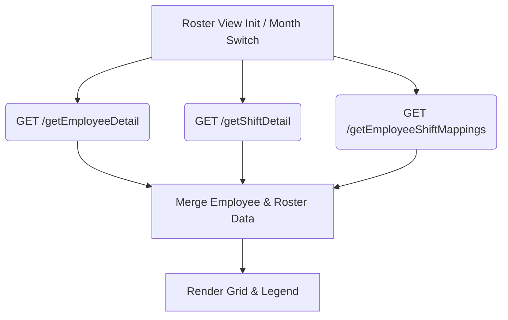

# API Design & Integration Overview (Lean UI-Driven Design)

This document outlines a revised, highly optimized API architecture for the roster management application. In line with the UI requirements, we have eliminated redundant endpoints to keep the integration as clean and maintainable as possible.

We have reduced the API footprint to **exactly 5 core endpoints** that strictly support the active UI views, modals, and actions.

---

## 1. Do We Need a Separate Schema for Each API?

> [!TIP]
> **No, you do not need a separate database schema/table for each API endpoint.** 
> Database tables represent core entities, whereas APIs represent interactions. Because of foreign key relationships, a single endpoint can join multiple entities or accept composite payloads.
> 
> * **Employee** and **Shift** act as master/lookup schemas.
> * **EmployeeShiftMapping** is the transactional junction schema that references them via foreign keys (`EmployeeId` and `ShiftId`).
> * Our APIs merge these relationships. For example, the `saveEmployeeShiftMapping` endpoint can accept an array of employee IDs, performing a bulk mapping operation in a single transactional write.

---

## 2. The 5 Core UI APIs

Below is the consolidated summary of the 5 APIs required to power the current UI:

| # | Endpoint | Method | Associated Schema | UI Component & Action |
| :-: | :--- | :-: | :--- | :--- |
| **1** | `/devum/theraphy/getEmployeeDetail` | `GET` | `Employee` | Loads employee list for roster rows & Bulk Add checklists. |
| **2** | `/devum/theraphy/getShiftDetail` | `GET` | `Shift` | Loads shift definitions to render legends and populate modals. |
| **3** | `/devum/theraphy/saveShift` | `POST` | `Shift` | Saves/updates shift configurations (start/end times, weekdays). | (extra)
| **4** | `/devum/theraphy/getEmployeeShiftMappings` | `GET` | `EmployeeShiftMapping` | Fetches active roster assignments for the selected calendar range. |
<!-- | **5** | `/devum/theraphy/saveEmployeeShiftMapping` | `POST` | `EmployeeShiftMapping` | Handles **Single Add/Modify**, **Bulk Add**, and **Delete** actions. | -->

---

## 3. Detailed API Specifications & Payloads

### 1. Get Employee Details (List)
* **Endpoint:** `/devum/theraphy/getEmployeeDetail`
* **Method:** `GET`
* **UI Usage:** Triggered on calendar page load. Fills the employee name card columns on the left of the grid.
* **Response Example:**
  ```json
  [
    {
      "employeeId": "EMP-001",
      "name": "Rahul Mehta",
      "email": "rahul.mehta@company.com",
      "contactNo": "+91 9876543210",
      "joiningDate": "2024-01-15",
      "image": "base64_img_string_or_url",
      "address": "Mumbai, Maharashtra",
      "idNumber": "ID-9928"
    }
  ]
  ```

---

### 2. Get Shift Details
* **Endpoint:** `/devum/theraphy/getShiftDetail`
* **Method:** `GET`
* **UI Usage:** Populates the legend strip colors, shift selection in the Edit/Modify modal, and the shift dropdown in the Bulk Add modal.
* **Response Example:**
  ```json
  [
    {
      "name": "General Shift",
      "startTime": "09:00:00",
      "endTime": "18:00:00",
      "weekDays": "Monday,Tuesday,Wednesday,Thursday,Friday",
      "isOperational": true,
      "doesShiftFallOnNextDay": false,
      "shiftInterval": "9 Hours"
    },
    {
      "name": "A Shift",
      "startTime": "06:00:00",
      "endTime": "14:00:00",
      "weekDays": "Monday,Tuesday,Wednesday,Thursday,Friday",
      "isOperational": true,
      "doesShiftFallOnNextDay": false,
      "shiftInterval": "8 Hours"
    }
  ]
  ```

---

### 3. Save Shift
* **Endpoint:** `/devum/theraphy/saveShift`
* **Method:** `POST`
* **UI Usage:** Used if shift times or operational rules are updated or added.
* **Request Payload Example:**
  ```json
  {
    "name": "Night Shift",
    "startTime": "22:00:00",
    "endTime": "06:00:00",
    "weekDays": "Monday,Tuesday,Wednesday,Thursday,Friday,Saturday,Sunday",
    "isOperational": true,
    "doesShiftFallOnNextDay": true,
    "shiftInterval": "8 Hours"
  }
  ```

---

### 4. Fetch Roster Mappings
* **Endpoint:** `/devum/theraphy/getEmployeeShiftMappings`
* **Method:** `GET`
* **Query Parameters:** `startDate` (e.g., `2026-05-01`), `endDate` (e.g., `2026-05-31`).
* **UI Usage:** Fetched when rendering the monthly, weekly, or daily view. The front end translates these range records into daily badges.
* **Response Example:**
  ```json
  [
    {
      "employeeId": "EMP-001",
      "startDate": "2026-05-26",
      "endDate": "2026-05-31",
      "shiftId": "General Shift",
    }
  ]
  ```

---

### 5. Save/Modify/Delete Employee Shift Mapping (Universal POST)
* **Endpoint:** `/devum/theraphy/saveEmployeeShiftMapping`
* **Method:** `POST`
* **UI Usage:** Serves as the single handler for all roster modification events. 
  1. **Single Day Add/Edit:** Modifies a single day's badge.
  2. **Bulk Add:** Maps shifts to multiple employees over a range of dates.
  3. **Delete:** Removes an employee's shift allocations.

#### Scenario A: Single Day Add/Edit
```json
{
  "action": "SAVE",
  "employeeIds": ["EMP-001"],
  "startDate": "2026-05-26",
  "endDate": "2026-05-26",
  "shiftId": "A Shift"
}
```

#### Scenario B: Bulk Add (Multiple Employees + Date Range)
```json
{
  "action": "SAVE",
  "employeeIds": ["EMP-001", "EMP-002", "EMP-004"],
  "startDate": "2026-05-26",
  "endDate": "2026-05-31",
  "shiftId": "B Shift"
}
```

#### Scenario C: Delete Roster Entries (Single or All)
* For deleting, set `action` to `"DELETE"`. To delete all assignments for an employee, provide a wide date range.
```json
{
  "action": "DELETE",
  "employeeIds": ["EMP-001"],
  "startDate": "2026-05-26",
  "endDate": "2026-05-26"
}
```

---

## 4. UI Data Processing Flow

When the UI initializes or the calendar month changes:

