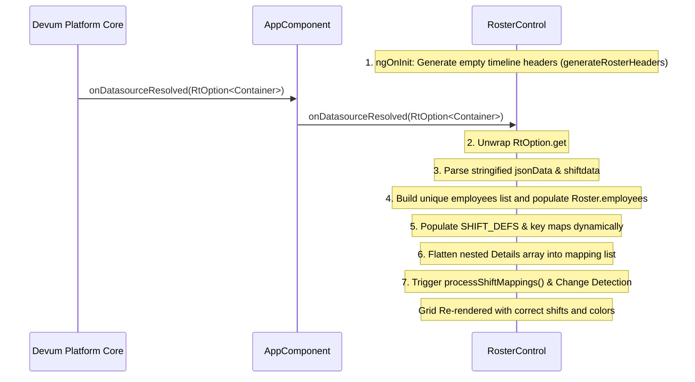

# Devum Datasource Integration & Resolution Guide

This document describes how the roster component integrates with the Devum platform via the `onDatasourceResolved` method, explaining the data structure, dynamic mapping, and runtime execution flow.

---

## 1. Overview of Devum Datasource Resolution

In the Devum platform, data binding between the backend actions and the custom UI widgets is managed via the **simple control callback lifecycle**. When a widget binds to a datasource (e.g. `RosterDS`), the platform executes the datasource query asynchronously and delivers the dataset directly to the component wrapper.

### The Callback Bridge
* **Method Binding**: The parent container wrapper (`AppComponent`) exposes an `@Input` callback named `onDatasourceResolved` (spelled with a lowercase **`s`** as `onDatasourceResolved`).
* **Trigger Mechanism**: Once the Devum engine successfully resolves the datasource query, it wraps the raw response in a option-like wrapper (`RtOption<any>`) and calls:
  ```typescript
  onDatasourceResolved(datasource: RtOption<any>)
  ```
* **Propagation**: The main `AppComponent` forwards the resolved payload to the child `RosterControl` component's `onDatasourceResolved` callback.

---

## 2. Payload Structure & Resolution Logic

The incoming payload arrives as a deeply nested `DataViewTimeSeriesItemContainer` shape. In Devum, text fields stored in document-like or JSON databases often arrive as stringified JSON strings. 

### Target JSON Structure
```json
{
  "className": "DataViewTimeSeriesItemContainer",
  "data": {
    "list": [
      {
        "jsonData": {  // <-- May arrive as a serialized JSON string
          "id": "660fb9542aacbd33a4a6d251",
          "employeename": "Ashok K",
          "employeenumber": "EMP-107",
          "Details": [
            {
              "date": "2025-07-01",
              "shiftid": "0b947677-ad5c-406c-9164-f6a372fae344",
              "shiftdata": [  // <-- May arrive as a serialized JSON string
                {
                  "id": "0b947677-ad5c-406c-9164-f6a372fae344",
                  "shiftname": "First Shift",
                  "shiftstarttime": "06:00:00",
                  "shiftendtime": "14:00:00"
                }
              ]
            }
          ]
        }
      }
    ]
  }
}
```

---

## 3. Step-by-Step Execution Flow in the Component



### Step 1: Initialize Grid Layout (ngOnInit)
The component initializes by calling `generateRosterHeaders()` to render the timeline columns (days, dates) based on the current calendar view parameters. No side-channel HTTP calls are made.

### Step 2: Unwrap and Extract Container
The handler validates that `data` is defined (`data.isDefined`) and extracts the raw object via `data.get`. Since the Devum host wraps resolved datasources in a `DsResult` or `DsResult[]` object, a local `getContainer()` helper function scans the fields recursively to parse and extract the payload matching `className: 'DataViewTimeSeriesItemContainer'`.

### Step 3: Deserialization (JSON.parse)
Since the `jsonData` field or the nested `shiftdata` field can arrive as serialized JSON strings from the database layer, the handler safely inspects their type:
```typescript
if (typeof jsonData === 'string') {
  jsonData = JSON.parse(jsonData);
}
```

### Step 4: Dynamic Employee Construction
Unique employee objects are constructed dynamically from the parsed `jsonData` elements:
* `employeenumber` is mapped directly to `EmployeeId`.
* `employeename` is mapped directly to `name`.
The list of unique employees is compiled and assigned to `this.employees`. This marks `this.employeesLoaded = true` and `this.isLoading = false`.

### Step 5: Dynamic Shift Dictionary Building
As the code loops through the employee records, it extracts the unique shift configurations inside `shiftdata`. It dynamically constructs a memory Map of unique shifts. It then populates the local shift cache `getShiftdetails61` and builds the layout definitions (`SHIFT_DEFS`) dynamically:
* Maps the shift UUID to a short shift key (e.g. `'First'`, `'Second'`, `'Third'`).
* Formats start/end times into labels (e.g. `06:00 - 14:00`).
* Computes CSS theme classes (`shift-first`) and colors (`#2196F3`).

### Step 6: Assignment Flattening
It extracts each record in the nested `Details` array and flattens it to fit the component interface:
```typescript
mappings.push({
  EmployeeId: empId,
  employeeName: empName,
  startDate: detail.date,
  endDate: detail.date,
  ShiftId: detail.shiftid,
  shift: shiftProfiles.get(detail.shiftid) || null
});
```

### Step 7: Binding & State Update
Finally, the flattened array is saved to `this.getEmployeeShiftMappings` and processed to populate the calendar slots map (`this.rosterAssignments`). `this.cdr.detectChanges()` is invoked to trigger change detection in the Angular view, re-rendering the cells.

---

## 4. Key Considerations for Devum Platform Integration

* **Case Sensitivity**: Devum binds properties using the case defined in the custom control configuration metadata. Ensure the input name in your control configuration matches `@Input() onDatasourceResolved` exactly (using a lowercase `s` in `Datasource`).
* **Strict Format Enforcement**: The `onDatasourceResolved` function strictly processes the nested `DataViewTimeSeriesItemContainer` format. If any unrecognized formats are encountered, it warns and drops them to avoid populating inconsistent data structures.
