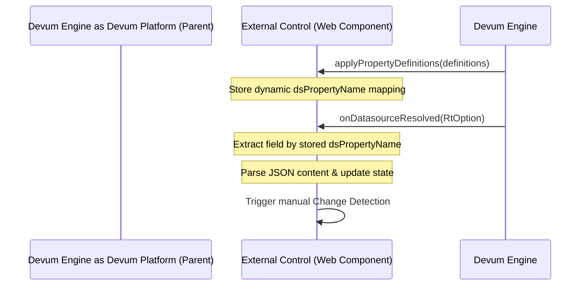

# Technical Documentation: `onDatasourceResolved` Implementation

This document provides a comprehensive technical guide on how the `onDatasourceResolved` callback is defined in the [external-den-core](file:///c:/Users/karan.s/Documents/Projects/External-Control/external-den-core) library and implemented within Angular-based Web Component external controls (such as the [BoreholeComponent](file:///c:/Users/karan.s/Documents/Projects/External-Control/borehole/src/app/borehole.component.ts)).

Use this guide to understand and implement similar data-source bindings in other codebases.

---

## 1. Architectural Overview

In the Devum platform ecosystem, **External Controls** are built as Web Components (Custom Elements) that are rendered within parent layouts. 

When a layout retrieves data from a configured data source (e.g., an API call or database query), it pushes the resolved dataset to the external control via the `@Input` property callback: **`onDatasourceResolved`**.



---

## 2. Library Definitions (`external-den-core`)

The callback signature is governed by the interfaces and classes defined in the [external-den-core](file:///c:/Users/karan.s/Documents/Projects/External-Control/external-den-core) library.

### The `ExternalCoreSimpleControl` Interface

Declared in [external-core-simple-control.d.ts](file:///c:/Users/karan.s/Documents/Projects/External-Control/external-den-core/src/external-core-simple-control.d.ts):

```typescript
export interface ExternalCoreSimpleControl {
    onDatasourceResolved(data: RtOption<any>): any;
    applyPropertyDefinitions(propertyDefinitions: ControlPropertyDefinitionValue[]): any;
    applyConfigurationAttributes(configurationAttributeValues: UsableAttributeValue<unknown>[]): any;
    setControlInstance(data: ControlInstanceWrapper): any;
}
```

### Supporting Classes and Entities

#### A. [RtOption](file:///c:/Users/karan.s/Documents/Projects/External-Control/external-den-core/src/ds-result-value.d.ts#L6)
`RtOption` is a functional container similar to `Option` / `Optional` in other languages. It wraps the data response to handle nullability safely:
* **`isDefined: boolean`**: Returns `true` if the option contains a non-null, non-undefined value.
* **`isEmpty: boolean`**: Returns `true` if the option has no value.
* **`get: T`**: Returns the unwrapped value (throws an error if empty).
* **`getOrElse(fn: () => T): T`**: Returns the value if defined, otherwise executes the function and returns the fallback.

#### B. [DsResult](file:///c:/Users/karan.s/Documents/Projects/External-Control/external-den-core/src/data-source-result-entities.d.ts#L43)
When `data.isDefined` is true, the unwrapped object `data.get` is an instance of `DsResult`:
* **`id: string`**: The unique identifier of the row/result.
* **`dsName: string`**: The name of the resolved Data Source.
* **`data: DsResultValue[]`**: The collection of column values.
* **`fks: string[]`**: Foreign keys associated with the record.
* **`dataStateType: DataStateType`**: Enum representing status (`APPLIED`, `INSERT`, `UPDATE`, `DELETE`).

#### C. [DsResultValue](file:///c:/Users/karan.s/Documents/Projects/External-Control/external-den-core/src/data-source-result-entities.d.ts#L32)
Each element in the `data.get.data` array is a `DsResultValue`:
* **`fieldName: string`**: The physical column/field name from the query.
* **`value: any`**: The resolved value (can be a primitive, a number, or a stringified JSON string).
* **`originalValue: any`**: The unmodified raw value.
* **`uom: RtOption<string>`**: Unit of measure, wrapped in `RtOption`.
* **`referenceData: RtOption<unknown>`**: Reference metadata.

---

## 3. Reference Implementation: `BoreholeComponent`

The data flow and integration details are implemented in [borehole.component.ts](file:///c:/Users/karan.s/Documents/Projects/External-Control/borehole/src/app/borehole.component.ts):

### Step 1: Mapping Property Names via `applyPropertyDefinitions`
Before the data source is resolved and pushed, the parent platform invokes `applyPropertyDefinitions`. This maps the internal attribute name of our component (`'boreholeData'`) to the dynamic database column name configured in the builder (`dsPropertyName`).

```typescript
private boreholeDataPropertyName: string;

@Input() applyPropertyDefinitions = (propertyDefinitions: ControlPropertyDefinitionValue[]) => {
  const boreholePropertyData = propertyDefinitions.find(
    (property) => property.controlAttributeName === BoreHoleDetailEnum.boleHoleData
  ) as ControlPropertyDefinitionValue;
  
  if (boreholePropertyData) {
    // Save the physical datasource field name (e.g., "borehole_details_column")
    this.boreholeDataPropertyName = boreholePropertyData.dsPropertyName as string;
  }
}
```

### Step 2: Receiving the Data via `onDatasourceResolved`
When the platform resolves the query, it triggers `onDatasourceResolved` with an `RtOption<DsResult>`.

```typescript
@Input() onDatasourceResolved = (data: RtOption<any>) => {
  if (!data) return;
  if (data.isDefined) {
    this.constructBoreholeData(data.get.data); // data.get.data is DsResultValue[]
  }
}
```

### Step 3: Parsing the Payload & Triggering Change Detection
Because the payload is stored as stringified JSON in the database, we parse it into a structured type (`BoreholeData`) and update the local component fields.

```typescript
private constructBoreholeData(data: any) {
  this.boreholeData = this.getBoreholeData(data);
  this.max = this.boreholeData.pointBValue;
  this.min = this.boreholeData.pointAValue;
  this.waterLevel = this.boreholeData.waterLevel;
  
  // CRITICAL: Trigger manual change detection
  this.changeDetectorRef.detectChanges();
}
```

#### The Parsing Logic in `getBoreholeData`
The parsing logic handles formatting issues (like single-quote string encapsulation) and nested JSON strings:

```typescript
private getBoreholeData(data: any[]) {
  // 1. Locate the correct data field by the name resolved in Step 1
  const boreholeDataField = data.find(item => item.fieldName === this.boreholeDataPropertyName);

  if (boreholeDataField && typeof boreholeDataField.value === 'string') {
    // 2. Replace all single quotes (often used to escape JSON strings in database payloads) and parse
    const boreholeData = JSON.parse(boreholeDataField.value.replaceAll("'", "")) as BoreholeData;

    // 3. Deep-parse nested fields if they are also serialized strings
    if (typeof boreholeData?.sensorDetail === 'string') {
      boreholeData.sensorDetail = JSON.parse(boreholeData.sensorDetail);
    }
    if (typeof boreholeData?.materialDetail === 'string') {
      boreholeData.materialDetail = JSON.parse(boreholeData.materialDetail);
    }

    return boreholeData;
  } else {
    throw new Error(`Borehole data field with name ${this.boreholeDataPropertyName} not found.`);
  }
}
```

> [!IMPORTANT]
> **Manual Change Detection (`changeDetectorRef.detectChanges()`)**:
> Since Custom Elements (Angular Elements Web Components) often run outside the standard Angular zone tracking context in their host layouts, automatic change detection does not fire on asynchronous input updates. Calling `changeDetectorRef.detectChanges()` manually is required to re-render the view.

---

## 4. Implementation Steps for Other Codebases

To implement `onDatasourceResolved` in a new external control codebase, follow these steps:

### 1. Declare Inputs and Interface Implementation
Ensure your component implements the [ExternalCoreSimpleControl](file:///c:/Users/karan.s/Documents/Projects/External-Control/external-den-core/src/external-core-simple-control.d.ts) interface.

```typescript
import { ChangeDetectorRef, Component, Input } from '@angular/core';
import { ControlPropertyDefinitionValue, ExternalCoreSimpleControl, RtOption } from 'external-den-core';

@Component({
  selector: 'my-custom-widget',
  templateUrl: './my-custom-widget.component.html'
})
export class MyCustomWidgetComponent implements ExternalCoreSimpleControl {
  private targetDsFieldName: string;
  public parsedData: any;

  constructor(private cdr: ChangeDetectorRef) {}
  
  @Input() setControlInstance = (instance: any) => {};
  @Input() applyConfigurationAttributes = (configs: any[]) => {};
}
```

### 2. Map the Data Source Column
Implement `applyPropertyDefinitions` to lookup the corresponding database column using the control's configured property attribute name.

```typescript
@Input() applyPropertyDefinitions = (propertyDefinitions: ControlPropertyDefinitionValue[]) => {
  const propDef = propertyDefinitions.find(pd => pd.controlAttributeName === 'widgetPayload');
  if (propDef) {
    this.targetDsFieldName = propDef.dsPropertyName as string;
  }
}
```

### 3. Handle Resolution & Change Detection
Implement `onDatasourceResolved`, extract the target field, deserialize it, and call `changeDetectorRef.detectChanges()`.

```typescript
@Input() onDatasourceResolved = (data: RtOption<any>) => {
  if (data && data.isDefined) {
    const rawList = data.get.data; // Array of DsResultValue
    
    const targetField = rawList.find(field => field.fieldName === this.targetDsFieldName);
    if (targetField) {
      try {
        this.parsedData = typeof targetField.value === 'string' 
          ? JSON.parse(targetField.value.replaceAll("'", "")) 
          : targetField.value;
      } catch (e) {
        console.error("Failed to parse field data", e);
        this.parsedData = targetField.value;
      }
      
      // Update UI explicitly
      this.cdr.detectChanges();
    }
  }
}
```
