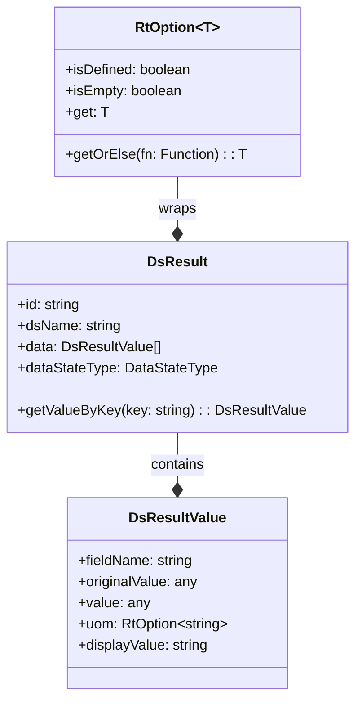
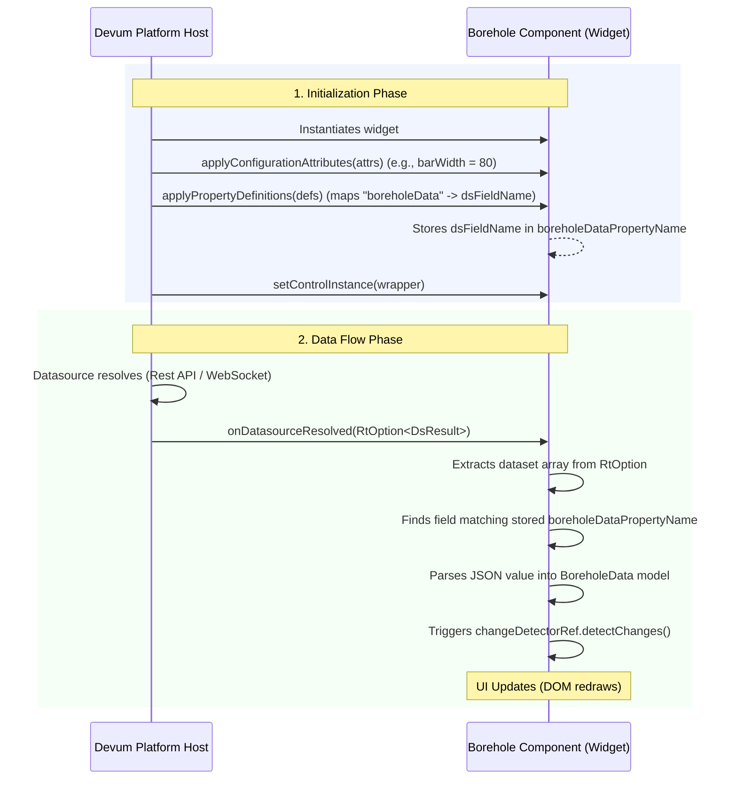

# Devum DataSource Integration Guide: `onDatasourceResolved`

---

## 0. AI-Optimized Integration Reference & Package Context

> [!IMPORTANT]
> **AI Instruction**: Use this section as a prompt-injectable reference when implementing, refactoring, or generating codebases that interface with `external-den-core`.

### 0.1 Package Context: Internal Usage of `onDatasourceResolved`
Within the `external-den-core` package, `onDatasourceResolved` is defined purely as an interface contract inside the `ExternalCoreSimpleControl` interface:

*   **Location**: `dist/external-den-core/src/external-core-simple-control.d.ts`
*   **Signature**: `onDatasourceResolved(data: RtOption<any>): any;`
*   **Role**: There is no runtime invocation or default implementation of this hook inside the `external-den-core` package itself. It exists purely to define the structural boundary (contract) shared between the **Devum Host Platform** (which triggers the callback when data changes) and **Custom Widgets/Codebases** (which implement the callback to consume the data).

### 0.2 Package Primitives Reference
When processing the `RtOption` passed to `onDatasourceResolved`, utilize the following type relationships from `external-den-core`:



### 0.3 AI Code Generation Guide: How to Integrate into Other Codebases
When writing a new component or class that integrates with this package, implement the following steps:

#### Step 1: Implement the Component Contract
Ensure your component class implements `ExternalCoreSimpleControl` and expose the methods as Inputs/Props depending on the framework (e.g., Angular `@Input()`, React Props, or Web Component Attributes). Note the spelling: `onDatasourceResolved` uses a lowercase `s`.

#### Step 2: Extract Mapped Property Names
Store the configuration-driven field names mapped by the host in `applyPropertyDefinitions` to find them later inside `onDatasourceResolved`.

#### Step 3: Implement the Extraction Pipeline
Extract the dataset, look up the target field by name, parse stringified values, and trigger change detection.

#### Framework-Agnostic Blueprint
```typescript
import { 
  ExternalCoreSimpleControl, 
  RtOption, 
  DsResult, 
  ControlPropertyDefinitionValue, 
  UsableAttributeValue,
  ControlInstanceWrapper
} from 'external-den-core';

export class DevumWidgetComponent implements ExternalCoreSimpleControl {
  private targetFieldName: string = '';
  public componentData: any = null;

  // 1. Capture designer metadata mapping
  applyPropertyDefinitions = (propertyDefinitions: ControlPropertyDefinitionValue[]) => {
    const propMapping = propertyDefinitions.find(
      (property) => property.controlAttributeName === 'yourInternalPropertyKey'
    );
    if (propMapping) {
      this.targetFieldName = propMapping.dsPropertyName as string;
    }
  };

  // 2. Resolve incoming datasource updates
  onDatasourceResolved = (data: RtOption<DsResult>) => {
    if (!data || !data.isDefined) return;

    // Retrieve DsResult array
    const dsResult = data.get;
    const fields = dsResult.data; // Array of DsResultValue

    // Find the field that matches the mapped field name
    const targetField = fields.find((f) => f.fieldName === this.targetFieldName);
    if (!targetField) return;

    // Handle single-quoted string payloads or primitives
    let resolvedValue = targetField.value;
    if (typeof resolvedValue === 'string') {
      try {
        resolvedValue = JSON.parse(resolvedValue.replaceAll("'", ""));
      } catch (e) {
        // Fallback to raw string if parsing fails
      }
    }

    this.componentData = resolvedValue;

    // 3. Force trigger rendering updates in custom container runtimes
    this.requestRenderUpdate();
  };

  // 4. Implement other required contract interfaces
  applyConfigurationAttributes = (configurationAttributeValues: UsableAttributeValue<unknown>[]) => {};
  setControlInstance = (data: ControlInstanceWrapper) => {};

  private requestRenderUpdate() {
    // E.g., changeDetectorRef.detectChanges() in Angular, or setState() in React
  }
}
```

---

This document provides a detailed technical breakdown of how the `onDatasourceResolved` hook is implemented in the Borehole widget, how it leverages interfaces and wrappers from the `external-den-core` package, and how the entire system integrates within the Devum Low-Code/No-Code platform runtime.

---

## 1. Architectural Overview

The Devum platform runs custom-built widgets (like the Borehole component) within a host container. This host container acts as the shell that provides styling configuration, data-source bindings, and handles event forwarding.

The interaction is governed by the `ExternalCoreSimpleControl` contract defined in `external-den-core`. 



---

## 2. Core Contract: `ExternalCoreSimpleControl`

The `external-den-core` package defines the contract interface that every external control must implement to be compatible with Devum.

### The Interface Definition
Defined in `external-den-core/src/external-core-simple-control.d.ts`:

```typescript
export interface ExternalCoreSimpleControl {
    onDatasourceResolved(data: RtOption<any>): any;
    applyPropertyDefinitions(propertyDefinitions: ControlPropertyDefinitionValue[]): any;
    applyConfigurationAttributes(configurationAttributeValues: UsableAttributeValue<unknown>[]): any;
    setControlInstance(data: ControlInstanceWrapper): any;
}
```

In the Borehole component, these are declared as `@Input()` properties so they can be set or called directly by the Devum host container when wrapping the Angular element.

---

## 3. Metadata Mapping & Property Definition

Before any data is resolved, the widget must know **which** field in the incoming dataset maps to its internal model. This is called the property mapping resolution.

In `borehole.component.ts`:

```typescript
enum BoreHoleDetailEnum {
  boleHoleData = 'boreholeData',
  barWidth = 'barWidth',
}

// ...

@Input() applyPropertyDefinitions = (propertyDefinitions: ControlPropertyDefinitionValue[]) => {
  const boreholePropertyData = propertyDefinitions.find(
    (property) => property.controlAttributeName === BoreHoleDetailEnum.boleHoleData
  ) as ControlPropertyDefinitionValue;
  
  if (boreholePropertyData) {
    this.boreholeDataPropertyName = boreholePropertyData.dsPropertyName as string;
  }
}
```

### Breakdown of the Mapping Flow:
1. **Host Action**: The Devum host calls `applyPropertyDefinitions` passing an array of `ControlPropertyDefinitionValue` mappings configured in the Devum Visual Designer.
2. **Lookup**: The widget searches for the mapping corresponding to the internal name `"boreholeData"`.
3. **Storage**: It extracts the `dsPropertyName` (the name of the dataset field mapped by the designer, e.g., `"borehole_spec"`) and stores it in `this.boreholeDataPropertyName`.

---

## 4. How `onDatasourceResolved` is Executed

Once the data source completes its query execution or receives a real-time update, the Devum host calls `onDatasourceResolved`.

```typescript
@Input() onDatasourceResolved = (data: RtOption<any>) => {
  if (!data) return;
  if (data.isDefined) this.constructBoreholeData(data.get.data);
}
```

### 4.1 Type Resolution: `RtOption` & `DsResult`
- **`data`**: Passed as an `RtOption<any>` (which wraps `DsResult` under the hood). `RtOption` acts as a functional monadic wrapper (`Some`/`None` pattern) to safely handle empty or null values.
- **`data.isDefined`**: Guarantees that a value is wrapped inside the option.
- **`data.get`**: Unwraps the `RtOption` to retrieve the `DsResult` object.
- **`data.get.data`**: Retrieves the array of `DsResultValue` records for the row. Each `DsResultValue` has the following structure:
  ```typescript
  class DsResultValue {
    fieldName: string;
    originalValue: any;
    value: any;
    uom: RtOption<string>;
    referenceData: RtOption<unknown>;
  }
  ```

### 4.2 Data Processing & State Construction
Once the data array is passed to `constructBoreholeData`, it is processed, parsed, and assigned to the local visualization state.

```typescript
private constructBoreholeData(data: any) {
  this.boreholeData = this.getBoreholeData(data);
  this.max = this.boreholeData.pointBValue;
  this.min = this.boreholeData.pointAValue;
  this.waterLevel = this.boreholeData.waterLevel;
  this.changeDetectorRef.detectChanges();
}
```

Inside `getBoreholeData(data)`:

```typescript
private getBoreholeData(data: any) {
  // 1. Locate the field that matches the dynamically mapped property name
  const boreholeDataField = data.find(data => data.fieldName === this.boreholeDataPropertyName);

  if (boreholeDataField && typeof boreholeDataField.value == 'string') {
    // 2. Normalize and parse the stringified JSON payload
    const boreholeData = JSON.parse(boreholeDataField.value.replaceAll("'", "")) as BoreholeData;

    // 3. Parse nested details if they are also serialized strings
    if (typeof boreholeData?.sensorDetail == 'string') {
      boreholeData.sensorDetail = JSON.parse(boreholeData.sensorDetail);
    }
    if (typeof boreholeData?.materialDetail == 'string') {
      boreholeData.materialDetail = JSON.parse(boreholeData.materialDetail);
    }

    return boreholeData;
  } else {
    throw new Error(`Borehole data field with name ${this.boreholeDataPropertyName} not found.`);
  }
}
```

> [!NOTE]
> Since Devum might store complex JSON data structures as stringified fields (often with single quotes `'` representing JSON strings), the parser cleans the string with `.replaceAll("'", "")` before running `JSON.parse`.

### 4.3 Change Detection Integration
Because Devum widgets are loaded dynamically and may bypass standard Angular Zone triggers, the component manually calls:
```typescript
this.changeDetectorRef.detectChanges();
```
This forces Angular to perform a template check immediately, updating the visual layers (water level position, soil layers, sensor heights) on the DOM.

---

## 5. Devum Platform Lifecycle Phases

The lifecycle of how the Devum platform host manages this integration can be summarized as follows:

| Phase | Callback / API Called | Responsibility of Devum Platform | Responsibility of Custom Widget |
| :--- | :--- | :--- | :--- |
| **1. Instantiation** | - | Creates the DOM container and injects the bundled code. | Initializes base class fields and dependency injection. |
| **2. Layout Configuration** | `applyConfigurationAttributes` | Delivers design-time attributes (e.g. `barWidth`, `height`). | Applies sizing logic and updates internal dimension variables. |
| **3. Binding Resolution** | `applyPropertyDefinitions` | Injects field mappings configured in the designer. | Matches widget keys (e.g., `boreholeData`) and stores the dataset column names. |
| **4. Instance Reference** | `setControlInstance` | Passes the unique control wrapper reference. | Captures context metadata for debugging or cross-control communication. |
| **5. Data Delivery** | `onDatasourceResolved` | Feeds the data rows wrapped in `RtOption<DsResult>`. | Filters values, parses JSON schemas, maps to visualization state, and triggers UI redraw. |

---

## 6. Widget Packaging & Compilation

To make this component runnable inside the Devum Platform:
1. **Compilation**: The Angular build process outputs transpiled runtime chunks (`runtime.js`, `polyfills.js`, `main.js`).
2. **Bundling**: The `build-component.js` script concatenates these files into a single, cohesive file:
   ```javascript
   // build-component.js
   const files = [
     './dist/borehole/runtime.js',
     './dist/borehole/polyfills.js',
     './dist/borehole/main.js'
   ];
   await concat(files, 'widget/borehole-widget1.js');
   ```
3. **Deployment**: Devum loads `widget/borehole-widget1.js` dynamically within a sandbox, making the compiled Angular components available to instantiate as custom components.
