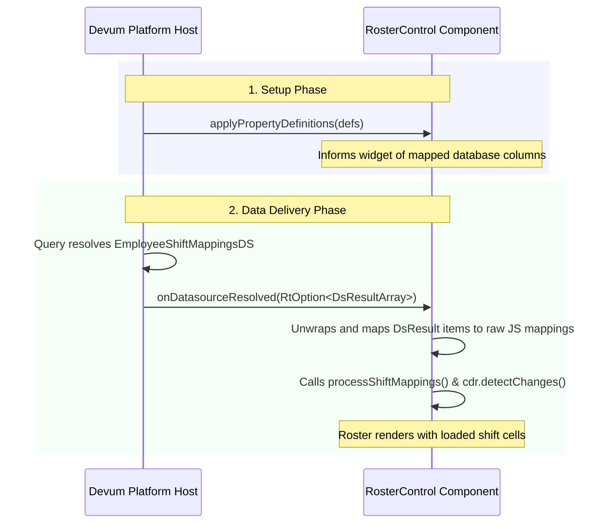

# Roster Control: Devum DataSource Integration Guide

This document details how the `RosterControl` widget integrates with Devum DataSources, specifically focusing on the `getEmployeeShiftMappings` data stream, how it processes records via the `onDatasourceResolved` hook, and how to troubleshoot mapping issues using the browser's developer console.

---

## 1. Runtime Flow & Architecture

Rather than making direct HTTP requests from the widget (which breaks inside the Devum runtime and hampers sandboxing), Devum manages the data fetch lifecycle on behalf of the widget.



---

## 2. Code Implementation Reference

The datasource resolution contract is implemented via two methods in the `RosterControl` component:

### 2.1 The Data Hook: `onDatasourceResolved`
This method intercepts the dataset wrapped in an `RtOption`, extracts the rows, converts them to raw objects, and updates the local assignment states.

```typescript
@Input()
onDatasourceResolved = (data: RtOption<any>) => {
  console.log('onDatasourceResolved called with:', data);
  console.log('onDatasourceResolved is working for getEmployeeShiftMappings');
  if (!data || !data.isDefined) {
    console.warn('onDatasourceResolved: data is undefined or empty');
    return;
  }

  const resolved = data.get;
  console.log('Unwrapped datasource value:', resolved);

  let mappings: any[] = [];

  // Check if the resolved value is a DsResultArray (has a results array)
  if (resolved && Array.isArray(resolved.results)) {
    mappings = resolved.results.map((dsResult: any) => this.mapDsResultToMapping(dsResult));
  } else if (resolved && Array.isArray(resolved)) {
    // Direct array of DsResult
    mappings = resolved.map((dsResult: any) => {
      if (dsResult instanceof DsResult || (dsResult.data && Array.isArray(dsResult.data))) {
        return this.mapDsResultToMapping(dsResult);
      }
      return dsResult;
    });
  } else if (resolved instanceof DsResult || (resolved && Array.isArray(resolved.data))) {
    // Single DsResult
    mappings = [this.mapDsResultToMapping(resolved)];
  } else {
    console.warn('onDatasourceResolved: unrecognized resolved data format, attempting direct assignment');
    mappings = Array.isArray(resolved) ? resolved : [resolved];
  }

  console.log('Parsed employee shift mappings from onDatasourceResolved:', mappings);
  this.processShiftMappings(mappings);
};
```

### 2.2 Field Extraction Helper: `mapDsResultToMapping`
This helper queries individual `DsResultValue` fields by name inside a single `DsResult` row.

```typescript
private mapDsResultToMapping(dsResult: any): any {
  const getValue = (key: string): any => {
    try {
      if (typeof dsResult.getValueByKey === 'function') {
        const val = dsResult.getValueByKey(key);
        return val ? (val.value !== undefined ? val.value : val.originalValue) : null;
      }
      if (Array.isArray(dsResult.data)) {
        const field = dsResult.data.find((f: any) => f.fieldName === key);
        return field ? field.value : null;
      }
    } catch (e) {
      console.error(`Error extracting key ${key} from DsResult:`, e);
    }
    return null;
  };

  return {
    EmployeeId: getValue('EmployeeId') || getValue('employeeId') || getValue('EmployeeID') || getValue('employeeid') || getValue('Employee'),
    ShiftId: getValue('ShiftId') || getValue('shiftId') || getValue('ShiftID') || getValue('shiftid') || getValue('Shift'),
    startDate: getValue('startDate') || getValue('start_date') || getValue('StartDate'),
    endDate: getValue('endDate') || getValue('end_date') || getValue('EndDate'),
  };
}
```

---

## 3. How to Troubleshoot Property Mapping Issues

If the roster table appears blank or displays unassigned shifts, the underlying cause is typically an **incorrect or missing property mapping** in the Devum Visual Editor. 

Follow these steps to analyze and debug the issue using the browser's Developer Console (F12):

### Step 1: Locate the Devum Log Output
Open the browser console and look for the logs printed by the datasource hook:
```
onDatasourceResolved called with: RtOption { value: DsResultArray { ... } }
onDatasourceResolved is working for getEmployeeShiftMappings
```

### Step 2: Inspect the Unwrapped Value
Expand the next log:
```
Unwrapped datasource value: DsResultArray { results: Array(X), ... }
```
1. Expand the `results` array.
2. Select any index item (e.g., `results[0]`, representing one database row).
3. Expand the `data` array inside that item. Each entry inside `data` represents a `DsResultValue`.

> [!NOTE]
> Each `DsResultValue` contains a `fieldName` key. This shows the column name returned by the Devum database layer.

### Step 3: Identify a Mapping Mismatch
Verify if the target column names match what `mapDsResultToMapping` expects:

| Expected Field Key | Example Database Field Names (Checked automatically) |
| :--- | :--- |
| **Employee ID** | `EmployeeId`, `employeeId`, `EmployeeID`, `employeeid`, `Employee` |
| **Shift ID** | `ShiftId`, `shiftId`, `ShiftID`, `shiftid`, `Shift` |
| **Start Date** | `startDate`, `start_date`, `StartDate` |
| **End Date** | `endDate`, `end_date`, `EndDate` |

#### Common Mismatch Signatures:
*   **Case A: Empty Fields in Console**
    ```
    Parsed employee shift mappings from onDatasourceResolved: 
    [ { EmployeeId: null, ShiftId: null, startDate: null, endDate: null } ]
    ```
    *   *Cause*: The query is returning data, but under field names not covered in our fallback search list (e.g., the database returns `emp_fk` or `shift_uuid`).
    *   *Solution*: Update `mapDsResultToMapping` to add the new database column keys to the `getValue()` search chain.

*   **Case B: `onDatasourceResolved` receives empty results**
    ```
    onDatasourceResolved called with: RtOption { value: undefined }
    ```
    *   *Cause*: The query did not return any records, or the bound datasource has no active mapping rules.
    *   *Solution*: Verify in the Devum Designer that the datasource is bound to the widget and has correct query filters applied.
